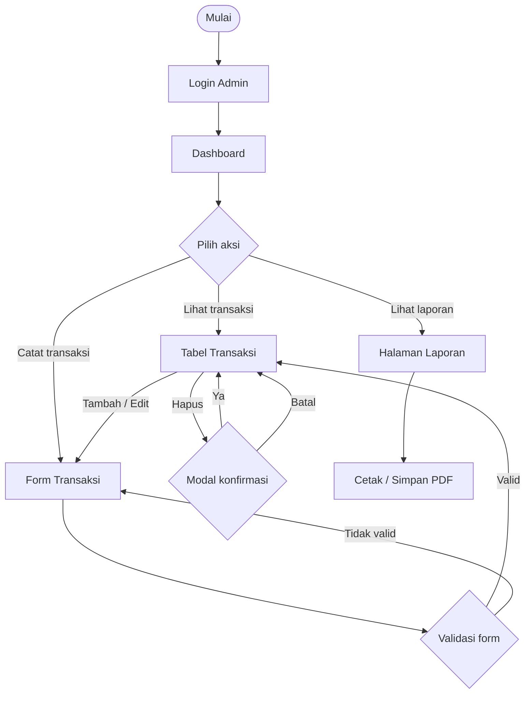
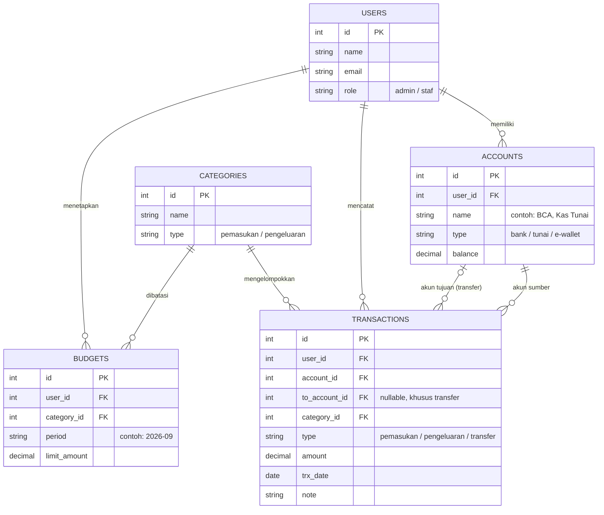

# PERANCANGAN — FinTrack: Admin Panel Dashboard Keuangan

> **Milestone 1** — Perencanaan Menu & UI Wireframing
> Nama: `Bayu samudra` | NIM: `231011401403` | Kelas: `07TPLE016`

---

## 1. Deskripsi Sistem

**FinTrack** adalah admin panel berbasis web (client-side) untuk memantau dan mengelola keuangan. Sistem ini menampilkan ringkasan pemasukan, pengeluaran, dan saldo dalam bentuk kartu dan grafik, serta menyediakan pengelolaan transaksi, akun/rekening, kategori, dan anggaran.

**Tujuan:**
- Memberi gambaran kondisi keuangan secara cepat lewat dashboard yang kaya grafik.
- Mempermudah pencatatan dan pencarian transaksi.
- Membantu pengguna membandingkan pengeluaran dengan anggaran.
- Menyediakan laporan yang bisa dicetak.

**Pengguna:**

| Peran | Kebutuhan utama |
|---|---|
| Admin / Pemilik | Melihat ringkasan, mengelola seluruh data, mencetak laporan |
| Staf Keuangan | Input dan edit transaksi, melihat laporan |

> Catatan: proyek ini hanya client-side. Data berupa *mock data* (array/JSON di JavaScript).

---

## 2. Hierarki Menu (Sidebar)

```text
FinTrack
├── 📊 Dashboard
├── 💸 Transaksi
│   ├── Semua Transaksi        (tabel + Tambah/Edit/Hapus)
│   ├── Tambah Pemasukan       (form)
│   ├── Tambah Pengeluaran     (form)
│   └── Transfer Antar Akun    (form)
├── 🗂️ Data Master
│   ├── Akun / Rekening        (tabel)
│   └── Kategori               (tabel)
├── 🎯 Anggaran (Budget)
│   └── Anggaran per Kategori  (tabel + progress bar)
├── 📑 Laporan
│   ├── Ringkasan Bulanan      (halaman cetak)
│   └── Arus Kas               (halaman cetak)
└── ⚙️ Pengaturan
    ├── Profil
    └── Preferensi (tema, mata uang)
```

**Navbar (header) berisi:** tombol toggle sidebar, kolom pencarian, notifikasi, dan menu profil (Profil, Keluar).

### Pemetaan Menu ke Halaman (Milestone 3)

| Halaman wajib | File | Menu terkait |
|---|---|---|
| Dashboard | `pages/dashboard.html` | Dashboard |
| Data Tabel (Master) | `pages/data-master.html` | Semua Transaksi, Akun, Kategori |
| Form Input/Edit | `pages/form.html` | Tambah Pemasukan/Pengeluaran/Transfer |
| Laporan/Detail | `pages/laporan.html` | Ringkasan Bulanan, Arus Kas |
| Login | `index.html` | — |

---

## 3. User Flow



---

## 4. Rancangan Basis Data (ER-D Sederhana)



**Keterangan singkat:**
- Satu `USER` bisa punya banyak `ACCOUNTS`, `TRANSACTIONS`, dan `BUDGETS`.
- `TRANSACTIONS` selalu terhubung ke satu `ACCOUNT` (sumber) dan satu `CATEGORY`. Untuk jenis *transfer*, kolom `to_account_id` diisi sebagai akun tujuan.
- `BUDGETS` membatasi pengeluaran per kategori per periode. Progress anggaran dihitung dari jumlah `TRANSACTIONS` pada kategori dan periode yang sama.

---

## 5. UI Wireframing (Stitch)

**Link / prompt Stitch:** `[tempel link proyek Stitch]`

| Halaman | Screenshot |
|---|---|
| Login |  |
| Dashboard |  |
| Tabel Transaksi |  |
| Form Transaksi |  |
| Laporan |  |

**Susunan komponen Dashboard (rencana):**
1. Baris kartu ringkasan: Total Saldo, Pemasukan Bulan Ini, Pengeluaran Bulan Ini, Selisih (Net).
2. Grafik garis: pemasukan vs pengeluaran per bulan.
3. Grafik donat: komposisi pengeluaran per kategori.
4. Grafik batang: realisasi vs anggaran.
5. Tabel "Transaksi Terbaru" (5 baris terakhir).

---

## 6. Design System (Figma)

**Link Figma (publik):** `[tempel link Figma, pastikan akses "Anyone with the link can view"]`

### 6.1 Color Palette

| Peran | Nama | HEX |
|---|---|---|
| Primary | Navy | `#1E3A5F` |
| Accent | Teal | `#0F9D8A` |
| Pemasukan / Sukses | Green | `#16A34A` |
| Pengeluaran / Bahaya | Red | `#DC2626` |
| Peringatan | Amber | `#F59E0B` |
| Latar halaman | Gray 50 | `#F8FAFC` |
| Permukaan (kartu) | White | `#FFFFFF` |
| Teks utama | Slate 900 | `#0F172A` |
| Teks sekunder | Slate 500 | `#64748B` |
| Border | Slate 200 | `#E2E8F0` |

> Warna di atas hanya usulan awal. Sesuaikan dengan hasil di Figma, lalu samakan dengan CSS variables di Milestone 2.

### 6.2 Typography

| Style | Font | Ukuran / Berat |
|---|---|---|
| Heading 1 | Inter | 28px / 700 |
| Heading 2 | Inter | 22px / 600 |
| Heading 3 | Inter | 18px / 600 |
| Body | Inter | 14px / 400 |
| Caption | Inter | 12px / 400 |
| Angka besar (kartu) | Inter | 24px / 700 |

### 6.3 Komponen Reusable

- **Button:** Primary, Secondary, Danger, Ghost (state: default, hover, disabled)
- **Form Input:** Text, Number/Currency, Date, Select, Textarea (state: default, focus, error)
- **Card:** Kartu ringkasan (ikon + label + angka + tren), kartu grafik
- **Tabel:** Header, baris, badge status, tombol aksi
- **Modal:** Konfirmasi hapus
- **Sidebar item:** Aktif, hover, dengan submenu
- **Badge:** Pemasukan (hijau), Pengeluaran (merah), Transfer (biru)

### 6.4 Desain High-Fidelity

| Halaman | Screenshot |
|---|---|
| Dashboard |  |
| Data Master |  |

---

## 7. Struktur Folder Proyek

```text
├── docs/
│   └── perancangan.md
├── assets/
│   ├── css/
│   ├── js/
│   └── img/
├── pages/
│   ├── dashboard.html
│   ├── data-master.html
│   ├── form.html
│   └── laporan.html
└── index.html
```

---

## 8. Checklist Milestone 1

- [ ] Hierarki menu lengkap
- [ ] ER-D Mermaid tampil (cek di preview GitHub)
- [ ] Wireframe Stitch tersedia dan screenshot tertaut
- [ ] Design System di Figma (palette, tipografi, komponen)
- [ ] High-Fidelity Dashboard dan Data Master
- [ ] Link Figma bersifat publik
- [ ] File di-push ke GitHub dan link repo dikirim lewat LMS Mentari
